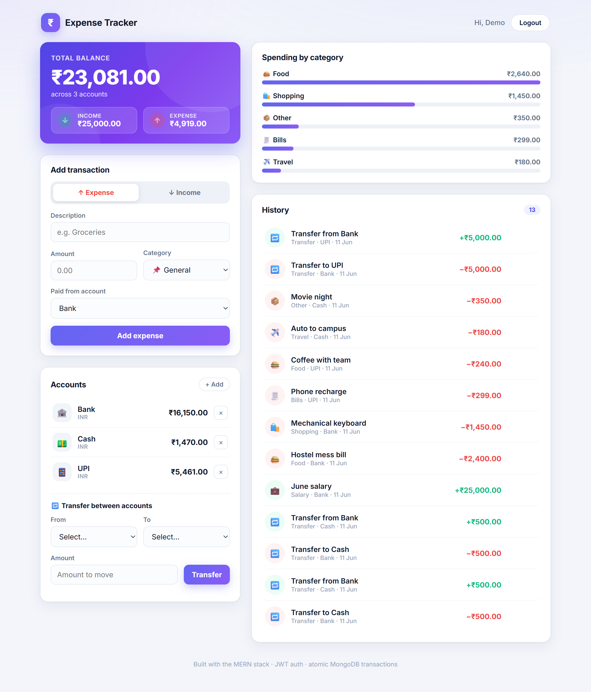

# Expense Tracker (MERN)

A **multi-user** personal-finance tracker: sign up, record income/expenses across
multiple accounts, move money between accounts with **atomic transfers**, and see
your spending broken down by category. Built on the MERN stack with a secure,
tested REST API.

> **Live demo:** https://expense-tracker-7q17.onrender.com · **Demo login:** `demo@example.com` / `demo1234`
>
> _Hosted on Render's free tier — the first request after idle takes ~50s while the instance spins up._



---

## Features

- **Account-linked ledger** — every transaction belongs to an account: income credits it, expense debits it, written **atomically** (ledger row + balance update in one MongoDB transaction). No account yet? A **Cash account is created automatically** so money always lands somewhere real.
- **JWT authentication** — register / login with bcrypt-hashed passwords; every API route is protected and data is isolated per user.
- **Full CRUD** on transactions — editing reverses the old balance effect and applies the new one; deleting refunds it.
- **Accounts & atomic transfers** — move money between accounts inside a **MongoDB ACID transaction** (debit + credit + ledger entries commit together or roll back).
- **Spending analytics** — income/expense totals and a per-category breakdown chart, computed with a **MongoDB aggregation pipeline** (transfers excluded, so income − expense always equals your balance).
- **Filtering & search** — by type, category, free-text description, and date range.
- **Hardened API** — `helmet`, rate limiting, NoSQL-injection sanitisation, and CORS.
- **Tested** — 16 Jest + Supertest integration tests against an in-memory MongoDB **replica set** (covers balance effects, transfer rollback, and cascade deletes).

## Tech stack

| Layer | Tech |
|---|---|
| Frontend | React, Context API + `useReducer`, Axios |
| Backend | Node.js, Express |
| Database | MongoDB + Mongoose |
| Auth | JSON Web Tokens, bcryptjs |
| Security | helmet, express-rate-limit, express-mongo-sanitize, cors |
| Testing | Jest, Supertest, mongodb-memory-server |

A deeper walkthrough of the architecture and the key design decisions lives in
**[DESIGN_NOTES.md](./DESIGN_NOTES.md)**.

## API reference

All `/transactions` and `/accounts` routes require an `Authorization: Bearer <token>` header.

| Method | Endpoint | Access | Description |
|---|---|---|---|
| POST | `/api/v1/auth/register` | Public | Register, returns a JWT |
| POST | `/api/v1/auth/login` | Public | Log in, returns a JWT |
| GET | `/api/v1/auth/me` | Private | Current user |
| GET | `/api/v1/transactions` | Private | List (filters: `type`, `category`, `search`, `from`, `to`) |
| POST | `/api/v1/transactions` | Private | Create a transaction |
| PUT | `/api/v1/transactions/:id` | Private | Update a transaction |
| DELETE | `/api/v1/transactions/:id` | Private | Delete a transaction |
| GET | `/api/v1/transactions/summary` | Private | Income/expense totals + per-category aggregation |
| GET | `/api/v1/accounts` | Private | List accounts |
| POST | `/api/v1/accounts` | Private | Create an account |
| DELETE | `/api/v1/accounts/:id` | Private | Delete an account |
| POST | `/api/v1/accounts/transfer` | Private | **Atomic** transfer between two accounts |

## Getting started

### Prerequisites
- Node.js 18+
- A MongoDB connection string. **Use MongoDB Atlas** (a replica set) — the atomic
  transfer endpoint uses transactions, which require a replica set (a bare local
  `mongod` won't run them).

### Setup
```bash
# 1. Install backend + frontend deps
npm install
npm install --prefix client

# 2. Configure environment
cp config/config.env.example config/config.env
#   then edit config/config.env and set MONGO_URI and JWT_SECRET

# 3. Run backend + frontend together (http://localhost:3000)
npm run dev

# Backend only (http://localhost:5000)
npm run server

# Run the test suite
npm test
```

## Project structure
```
.
├── app.js                 # Express app (middleware + routes), exported for tests
├── server.js              # Boots the app + DB connection
├── config/
│   ├── db.js              # Mongoose connection
│   └── config.env.example # Copy to config.env (gitignored)
├── middleware/
│   ├── async.js          # async/await error-forwarding wrapper
│   ├── auth.js           # JWT "protect" gatekeeper
│   └── error.js          # central error handler
├── models/               # User, Account, Transaction (Mongoose schemas)
├── controllers/          # auth, transactions, accounts (business logic)
├── routes/               # auth, transactions, accounts (Express routers)
├── tests/                # Jest + Supertest integration tests
└── client/               # React app (Context API)
```

## Roadmap
- Pagination on the transaction list
- Recurring transactions & monthly budgets with alerts
- Refresh-token rotation
- CSV import/export
- Charts dashboard (category & monthly trends)

## License
MIT
